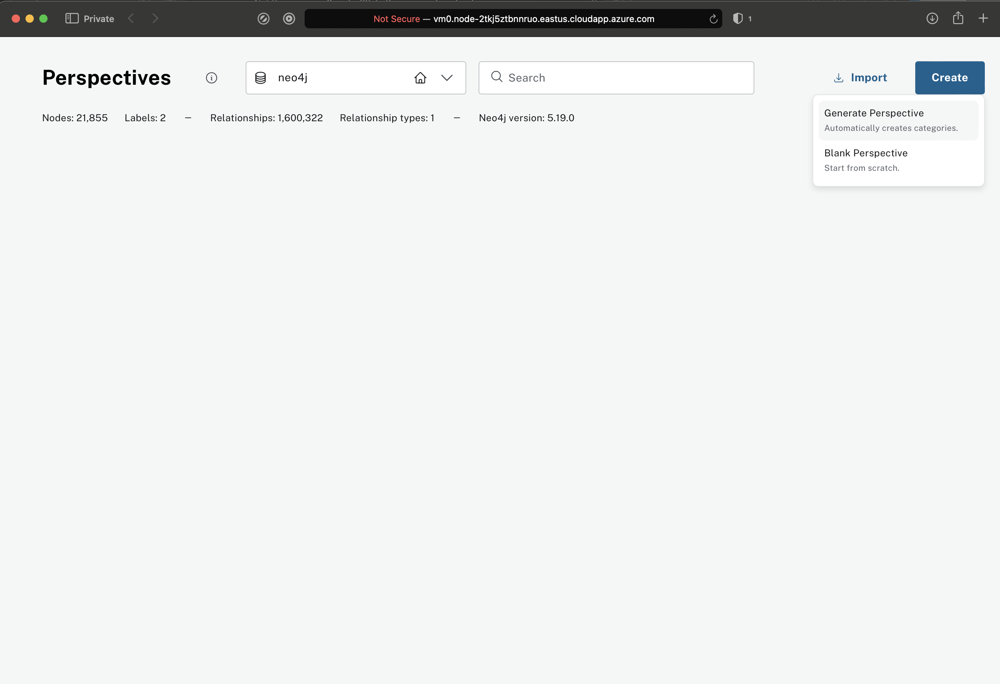
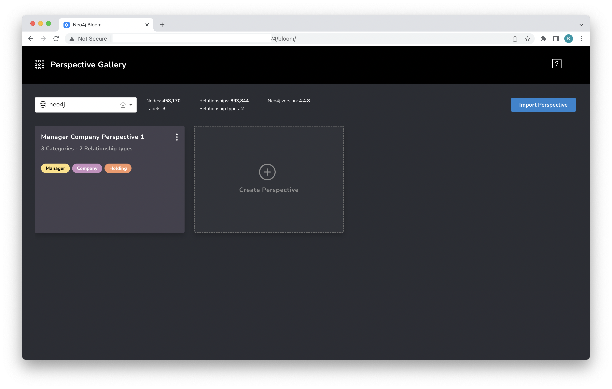
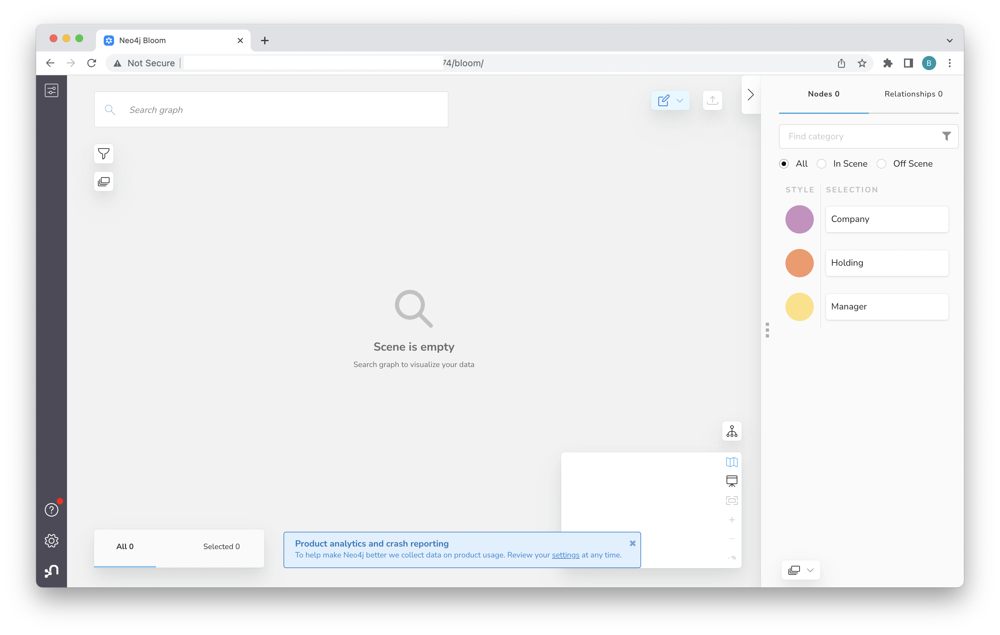
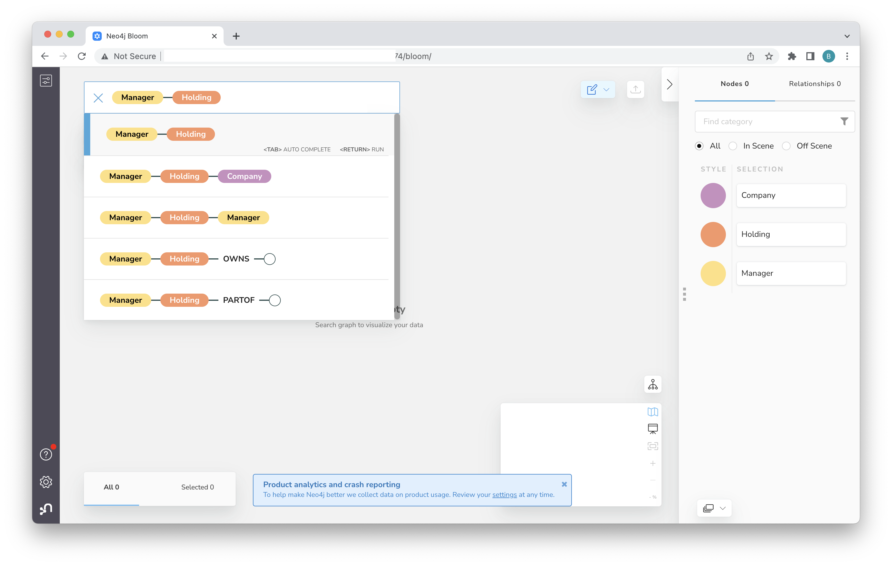
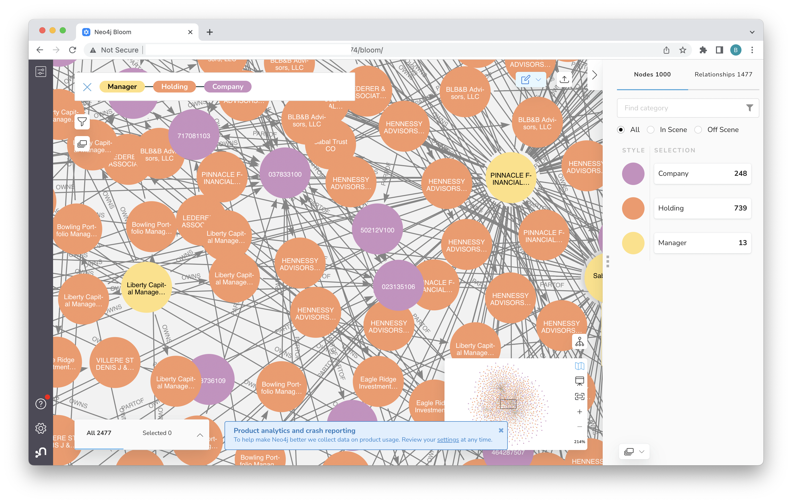

# Lab 4 - Exploring Data
In this lab, we're going to use Bloom to explore our data set a bit.  Bloom is Neo4j's business intelligence (BI) tool.

## Vizualization with Neo4j Bloom
You can open Bloom as we did in Lab 2.  In my case, the URL was http://vm0.node-abcd.southeastasia.cloudapp.azure.com:7474/bloom/.  

When open Bloom, you should see the login screen.  Use the same credentials we used before.

That should take you to the home screen.  A perspective is a specific visualization on your data.  To get started, click "Create Perspective."

Now click "Generate Perspective."

Mouse over the perspective you just generated and click on "Use Perspective" to open it.

Click in the search bar and then click on "Manager."

Then click on the link for manager-holding.

Then click on the link to add manager-holding-company.

And now hit enter to run the query.

That will give you a view with many nodes.  The result here shows all paths from a manager to a holding to a company.  If we'd searched paths for say company to company we wouldn't have gotten any results since there are no such paths in our graph.

Now, spend a bit of time exploring the graph.  You can zoom in by holding on the "+" icon.  You can also drag the canvas around to choose what you zoom in on.

This is only a tiny bit of what Bloom can do.  

Two additional things you can try are:
(1) Invoking Graph Data Science (GDS) algorithms for centrality
(2) Filtering the displayed nodes

You can learn more about Bloom in the documentation [here](https://neo4j.com/docs/bloom-user-guide/current/bloom-tutorial/).  Feel free to explore!
