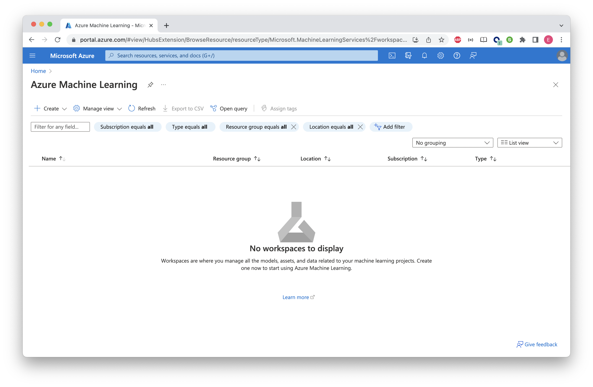
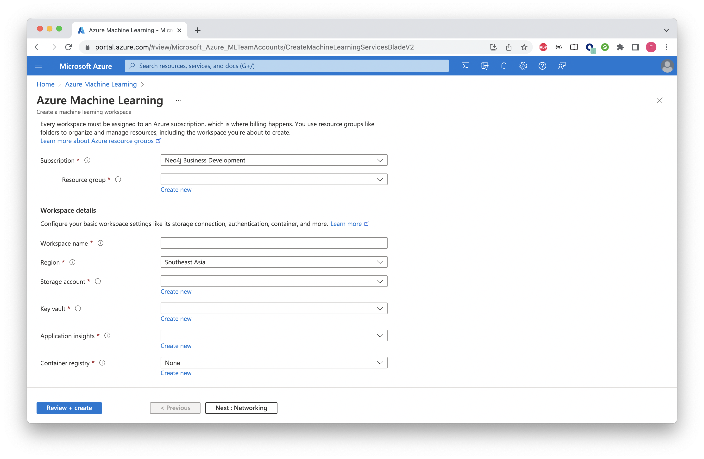
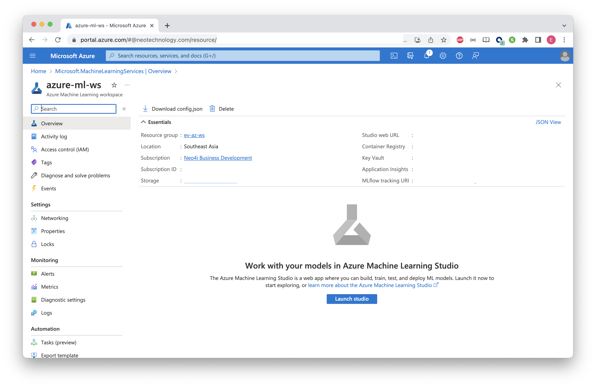

# Lab 5 - Parsing Data
In this lab we're going to parse data with generative AI to create a knowledge graph. We'll use the generative AI functionality in Google Cloud Vertex AI.

We'll be using some of the same data we loaded from a CSV earlier. However, this time, we'll parse the raw files from the SEC. This is really neat as we're using generative AI to parse something that required complex python scripts. Essentially we're trading generative AI compute time for developer time. Making this sort of trade possible is exactly why computers were invented! In this case, we're sidestepping scripts that took months of effort to harden, so it's an excellent trade.

## Create an Azure ML Service
The first step is to deploy an Azure ML Service.  To do that, open the Azure portal [here](https://portal.azure.com)

In the search bar, type "Azure Machine Learning."

Click on "Azure Machine Learning" as shown below.




Let's create a new Workspace inside Azure ML

Click on "Create" and select "New workspace"


Provide the required configuration to create a new Workspace.

* Resource Group - select the pre created resource group
* Region - Austrailia East



Click on "Review + create." 

Review the configuration and click "Create."


You will see the Deployment complete screen once done.

You can go to the resource by clicking "Go to resource."


Your new Workspace will look similar to this, if everything goes well.



Click on "Launch Studio" to open the Azure ML Studio. This is the place where you can create notebooks, compute etc.


Before importing and running notebooks, let's create a compute instance.


Provide the compute name and select "Standard_DS11_v2" for the compute VM Size.


After clicking "Create" you will see the compute instance in the new page.


## Setup Azure OpenAI
From the global 'search bar' on the top, search for `Azure OpenAI` and click on the service as shown below.


Click on the `Create` button on the top to spin off a new Azure OpenAI service.


Select your subscription and resource group you created for this lab.

For the Region - select `Australia East` and provide a unique name.


When you are done, click the `Go to resource` button.


From the left menu, click on `Keys and Endpoint` under the `Resource Management` section.
You will find the API keys and Base URL in this page which will be used later in the lab notebooks.


Now, go to `Manage Deployments` page and click the button `Manage Deployments` in that page.


You will be taken to the deployments page in Azure OpenAI Studio as below. Let us deploy some instances of the OpenAI models that will be used in this lab.

Click `Create new deployment` button.


Select `gpt-4` and enter the required information as below. Provide the model name as the deployment name as well.

For the quota, pick the maximum available for your instance. In this screenshot, we went for 80K which is the maximum number.


After the `gpt-4` model is deployed, let us deploy the encoding model - `text-embedding-ada-002` which will be used to convert text to word embeddings.

Similar to gpt-4, provide the model name as deployment name and go for the maximum quota.


With our models deployed, let us start using them.

## Import Lab Notebooks to ML Studio
For the rest of the labs, we're going to be working with iPython notebooks in ML Studio.

Clone this repository to Azure ML Studio as below:

* In the left menu bar, under `Authoring` section, click `Notebooks` menu.
* Click on the `Terminal` icon to open a terminal where you can run the following command

```
git clone https://github.com/neo4j-partners/hands-on-lab-neo4j-and-azure.git
```


Hit the refresh icon after cloning. You will see the cloned respository folder.

Now we'll run a few queries using the python API.  Earlier we used the graphical interface in the Neo4j Browser.  We're going to do the same thing but in a programmatic way.  Let's start by firing up a notebook.  Find the `/Users/<YOUR_NAME>/notebooks/hands-on-lab-neo4j-and-azure-ml/Lab 5 - Parsing Data/parsing-data.ipynb` in the Studio menu, double-click and then run through the notebook.
